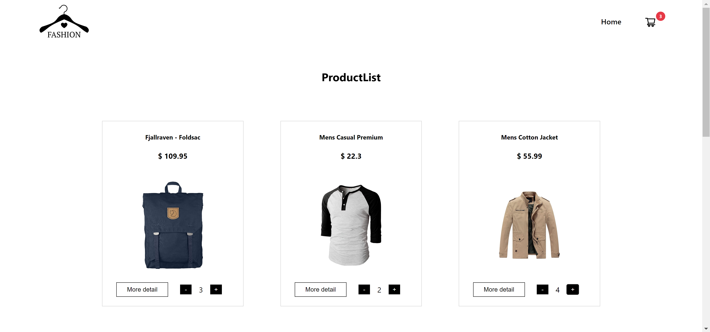
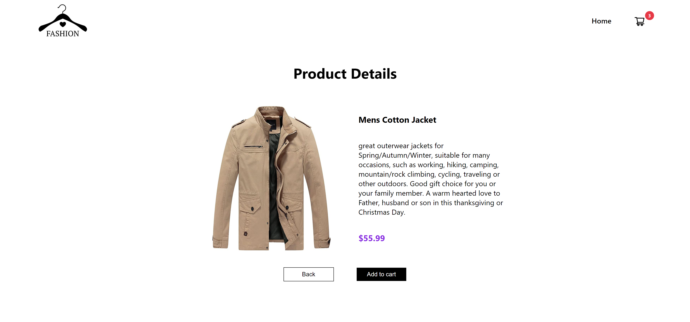

# React assignment (public repo)

This assignment is to practice React : passing props, React hook: useState, useEffect and React router

## WebPage Link:

[shopping link][click to open]

## How to run project

1. Step 1: yarn
2. Step 2: yarn start

## Screenshots

[click to open]: https://isa-6-react-shopping-cart.vercel.app/
